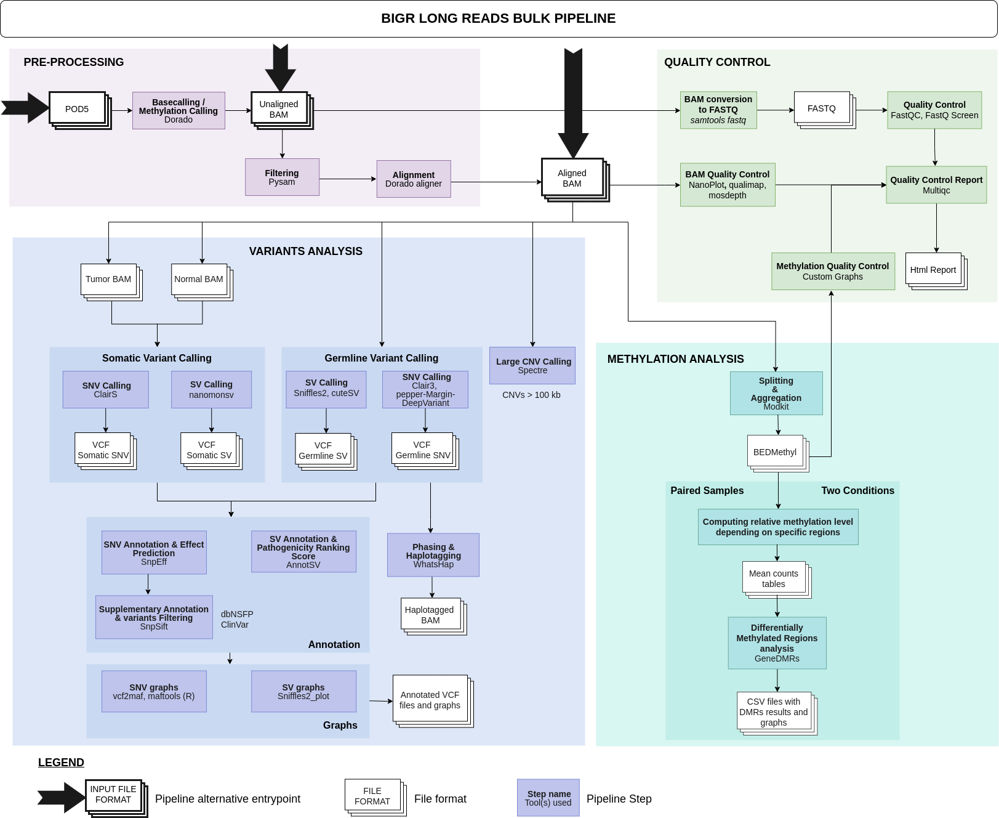

# :dna: bigr_long-reads_bulk
This pipeline is built to analyse bulk long-reads DNA-seq data from PromethION (Oxford Nanopore Technologies). It can perform basecalling and methylation calling, Differential Methylated Regions analysis, germline and somatic variants identification (SNV, SV, long CNV) and phasing. 

POD5 directory or BAM files (aligned BAM) are accepted as input.

## Table of Contents
1. [Pipeline Overview](#clipboard-pipeline-overview)
2. [Installation](#gear-installation)
    - [Gustave Roussy users](#gustave-roussy-users)
    - [External users](#external-users)
3. [Usage](#book-usage)
    - [Input files](#input-files)
    - [Run the pipeline](#run-the-pipeline)
4. [Pipeline Description](#mag_right-pipeline-detailed-description)
  
***
## :clipboard: Pipeline Overview



This pipeline is designed to perform :
- Preprocessing: Basecalling and Methylation calling
- Quality control
- Differential Methylated Regions (DMR) analysis between alls samples and/or between two conditions
- Germline and Somatic Single Nucleotid Variants (SNV) identification
- Germline and Somatic Structural Variants (SV) identification
- Long Copy Number Variations (CNV) identification
- Phasing

Go to [pipeline detailed description](#mag_right-pipeline-detailed-description) to see details about each pipeline step and watch the rule order on the [rulegraph](images/rulegraph.png).

***

## :gear: Installation
### Gustave Roussy users
The pipeline and environments are already installed on the Flamingo cluster of Gustave Roussy.  
It is localised at `/mnt/beegfs/pipelines/bigr_long-reads_bulk/<VERSION>`. You can check [Usage](#book-usage) section.

### External users
#### :one: Download pipeline
```
cd /path_to_pipeline_installation_dir/
VERSION="2.0.0"
git clone https://github.com/gustaveroussy/bigr_long-reads_bulk.git ${VERSION}
```
#### :two: Download Singularity images
Download all singularity images from [Zenodo](https://zenodo.org/records/13619512) in the directory `/path_to_pipeline_installation_dir/${VERSION}/envs/singularity/` of the cloned repository.
#### :three: Install Snakemake environment
```
source /mnt/beegfs/software/miniconda/24.3.0/etc/profile.d/conda.sh
conda env create -f /path_to_pipeline_installation_dir/${VERSION}/envs/conda/snakemake.yaml --prefix=/path_to_pipeline_installation_dir/${VERSION}/envs/compiled_conda/snakemake -y
```

You are now ready to use the pipeline!

***

## :book: Usage

### Input files
You need to create 2 mandatory input files: a [configuration file](#one-configuration-file) and a [design file](#two-design-file). You can also add an optional file containing a [list of genes of interest](#three-genes-of-interest-file-optional).

#### :one: Configuration file
3 models of configuration files are available in `config/` directory, depending on the genome of reference used during the analysis.
You can copy/paste and modify any model config file to fit your needs:
- [config_hg38.yaml](config/config_hg38.yaml): For human genome, using GRCh38 reference genome.
- [config_T2T.yaml](config/config_T2T.yaml): For human genome, using T2T-CHM13 v2.0 reference genome.
- [config_mm10.yaml](config/config_mm10.yaml):  For mouse genome, using GRCm38 reference genome.

> [!WARNING]
> We recommand using an Ensembl reference genome. Otherwise, please [submit an issue](https://github.com/gustaveroussy/bigr_long-reads_bulk/issues/new/choose) if using another database reference fasta file triggers pipeline errors.

There are various fields of interest in the config file:

- **input_format:** accepts `pod5` (POD5 directory) or `bam` (aligned BAM file). 

- **basecalling_mode:** accepts `basic` or `methylation`. Choose if you wish to perform basecalling only or methylation calling (5mCG and 5hmCG in Super Accuracy = SUP).

- **variant_calling_mode:** accepts `germline` or `somatic`. Choose the variant calling mode if you want to perform variant calling.

- **steps:** The configuration file allows you to choose which step(s) will be executed by the pipeline by setting any step name to `true` or `false`.
```
steps:
  basecalling: true
  alignment: true
  differential_methylation_sample: true
  differential_methylation_condition: true
  snv_calling: true
  sv_calling: true
  phasing: true
  cnv_calling: true
```
`differential_methylation_sample:` DMR analysis between every pair of samples extracted from the design file.
`differential_methylation_condition:` DMR analysis between two conditions/groups extracted from the design file.

You can change various fields in the `config.yaml` file such as tools parameters _(example: you can select the specific filters you want to apply after SNV calling)_.

#### :two: Design file
It must be a comma separated file (.csv where comma is ",") and its path should be given in the `config.yaml` file. Field names are the following and depend on the analysis you wish to perform:
- **sample_id _(required)_**: the sample name of you sample (it could be different that your fastq files).
- **path_file _(required)_**: absolute path to the BAM file or to the POD5 directory.
- **methyl_group _(optional)_**: name of the group/condition corresponding to the sample, it will be used only for DMR analysis. You can only use 2 groups/conditions at the moment, named `case` and `control`.
- **somatic_ctrl _(optional)_**: sample id corresponding to the normal sample.
- **cnv_cancer _(optional)_**: boolean to identify the sample as normal or cancer sample, for CNV analysis.

<ins>Example:</ins>
```
sample_id,path_file,methyl_group,somatic_ctrl,cnv_cancer
sample1_Tumor,/mnt/beegfs/scratch/n_rabearivelo/test_pipeline/methylation/data_input/sample1_Tumor/,case,sample1_Normal,TRUE
sample1_Normal,/mnt/beegfs/scratch/n_rabearivelo/test_pipeline/methylation/data_input/sample1_Normal/,control,,FALSE
sample2_Tumor,/mnt/beegfs/scratch/n_rabearivelo/test_pipeline/methylation/data_input/sample2_Tumor/,case,sample2_Normal,TRUE
sample2_Normal,/mnt/beegfs/scratch/n_rabearivelo/test_pipeline/methylation/data_input/sample2_Normal/,control,,FALSE
```

<details>

**<summary>Other design files examples</summary>**


POD5 directory as input, `differential_methylation_condition` step can not be performed without `methyl_group` column and `somatic` variant calling mode can not be used:
```
sample_id,path_file
sample1_KO,/mnt/beegfs/scratch/n_rabearivelo/test_pipeline/methylation/data_input/sample1/pod5_dir/
sample2_WT,/mnt/beegfs/scratch/n_rabearivelo/test_pipeline/methylation/data_input/sample2/pod5_dir/
```

BAM file as input, every step can be executed, except the `somatic` variant calling mode without `somatic_ctrl` column:
```
sample_id,path_file,methyl_group
sample1_KO,/path/to/input/file/sample1.bam,case
sample2_WT,/path/to/input/file/sample2.bam,control
```
</details>

> [!NOTE]
> - sample_id should not contain special characters, spaces or '_vs_'.
> - each aligned BAM file used as input must be sorted and have its bai index in the same directory than them.
> - if you need to concatenate POD5 files for one sample, you only need to put them all in the same input directory that you give in the design file.

#### :three: Genes of interest file _(optional)_
You can create a .txt file containing a list of genes of interest for your analysis, its path will be given in the `config.yaml` file. It should have one gene name per line. The gene name should come from HUGO Gene Nomenclature Committee (HGNC) gene symbol. It can be used by some tools to plot supplementary graphs specifically for these genes (maftools lollipop plots).
```
TP53
ATM
BARD1
BRCA1
BRCA2
CHEK2
NF1
```

### Run the pipeline
You need snakemake and singularity. For GR users, as they are already installed on Flamingo (snakemake via conda and singularity via `module load`) just follow the example below.  
Don't forget to change the version of the pipeline and the path to your configuration file.  

<ins>Script example:</ins>
```
#!/bin/bash
#using: sbatch run.sh
#SBATCH --job-name=LR_analysis
#SBATCH --nodes=1
#SBATCH --cpus-per-task=1
#SBATCH --mem=250M
#SBATCH --partition=longq

source /mnt/beegfs/software/miniconda/24.3.0/etc/profile.d/conda.sh
conda activate /mnt/beegfs/pipelines/bigr_long-reads_bulk/<version>/envs/conda/snakemake
module load singularity

LR_pipeline="/mnt/beegfs/pipelines/bigr_long-reads_bulk/<version>/"

snakemake --profile ${LR_pipeline}/profiles/slurm \
          -s ${LR_pipeline}/Snakefile \
          --configfile /path_to_my_configuration_file/config.yaml
```

***

## :mag_right: Pipeline detailed description

### Basecalling & Methylation calling
|       **Step**      | **Tool** |                       **Description**                              |
|:-------------------:|:--------:|:------------------------------------------------------------------:|
| Basecalling         | [Dorado](https://github.com/nanoporetech/dorado)   | Perform basecalling (SUP)                                          |
| Methylation calling | [Dorado](https://github.com/nanoporetech/dorado)   | Perform methylation calling for 5mCG and 5hmCG modifications (SUP) |
### Alignment
|     **Step**    	|     **Tool**     	|                                      **Description**                                     	|
|:---------------:	|:----------------:	|:----------------------------------------------------------------------------------------:	|
| Filter          	| python script    	| Filter to keep only reads with quality score >Q10 and length >200                       	|
| Alignment       	| [Dorado](https://github.com/nanoporetech/dorado) 	| Align sample reads to the reference genome, remove secondary alignments                 	|
| Concatenate BAM 	| [samtools](https://www.htslib.org/doc/#manual-pages)         	| As POD5 files were treated by batch, BAM concatenation is more convenient for next steps 	|
| Sort, index     	| [samtools](https://www.htslib.org/doc/#manual-pages)         	| Sort and index the just generated BAM files                                             	|
### Quality Control
|   **Step**   |      **Tool**      |                                  **Description**                                  |
|:------------:|:------------------:|:---------------------------------------------------------------------------------:|
| BAM QC       | [NanoPlot](https://github.com/wdecoster/NanoPlot), [Qualimap](http://qualimap.conesalab.org/doc_html/index.html) | Generate general QC metrics and graphs regarding a BAM file                       |
| BAM QC       | [Mosdepth](https://github.com/brentp/mosdepth)           | Calculate the depth of coverage of a BAM file                                     |
| BAM to FASTQ | [samtools](https://www.htslib.org/doc/#manual-pages)           | Convert BAM file to FASTQ file for supplementary QC                               |
| FASTQ QC     | [FastQC](https://www.bioinformatics.babraham.ac.uk/projects/fastqc/)             | Perform QC on FASTQ file                                                          |
| FASTQ QC     | [FastQ-Screen](https://github.com/mp15/FastQ-Screen/tree/minimap2)       | Perform library quality check on FASTQ file                                       |
| QC report    | [MultiQC](https://multiqc.info/docs/)            | Aggregates BAM and FASTQ QC results to generate a final QC report for all samples |
### Differential Methylation Analysis
|     **Step**     |   **Tool**   |                                         **Description**                                        |
|:----------------:|:------------:|:----------------------------------------------------------------------------------------------:|
| DMR by sample    | [GeneDMRs (R)](https://github.com/xiaowangCN/GeneDMRs/blob/master/GeneDMRs.pdf) | Differentially methylated regions analyses (Alu, Transcripts, CpG) for and between all samples |
| DMR by condition | [GeneDMRs (R)](https://github.com/xiaowangCN/GeneDMRs/blob/master/GeneDMRs.pdf) | Differentially methylated regions analyses (Alu, Transcripts, CpG) between two conditions      |
### Germline variant calling
|        **Step**        |              **Tool**             |                                                **Description**                                               |
|:----------------------:|:---------------------------------:|:------------------------------------------------------------------------------------------------------------:|
| SNV calling            | [Clair3](https://github.com/HKU-BAL/Clair3), [PEPPER-Margin-DeepVariant](https://github.com/kishwarshafin/pepper) | Call Single-Nucleotide Variants                                                                              |
| SNV annotation         | [SnpEff](https://pcingola.github.io/SnpEff/snpeff/introduction/), [SnpSift](https://pcingola.github.io/SnpEff/snpsift/introduction/)                   | Annotate Single-Nucleotide Variants using ClinVar and/or dbNSFP                                              |
| SNV filtering          | [SnpSift](https://pcingola.github.io/SnpEff/snpsift/introduction/)                           | Filter depending on the parameters entered in the config file                                                |
| SNV graphs             | [vcf2maf](https://github.com/mskcc/vcf2maf), [maftools (R)](https://github.com/PoisonAlien/maftools)             | Convert VCF to MAF file and generate general graphs by sample and graphs by gene if given in the config file |
| SV calling             | [Sniffles2](https://github.com/fritzsedlazeck/Sniffles), [cuteSV](https://github.com/tjiangHIT/cuteSV)                 | Call Structural Variants                                                                                     |
| SV annotation          | [AnnotSV](https://github.com/lgmgeo/AnnotSV)                           | Annotate SV                                                                                                  |
| SV graphs              | [Sniffles2_plot](https://github.com/farhangus/Sniffles2_plot)                    | Generate general graphs by sample                                                                            |
| Long CNV calling       | [Spectre](https://github.com/fritzsedlazeck/Spectre)                           | Call long CNV >100kb                                                                                         |
### Somatic variant calling
|    **Step**    |        **Tool**       |                                                **Description**                                               |
|:--------------:|:---------------------:|:------------------------------------------------------------------------------------------------------------:|
| SNV calling    | [ClairS](https://github.com/HKU-BAL/ClairS)                | Call somatic Single-Nucleotide Variants                                                                      |
| SNV annotation | [SnpEff](https://pcingola.github.io/SnpEff/snpeff/introduction/), [SnpSift](https://pcingola.github.io/SnpEff/snpsift/introduction/)       | Annotate Single-Nucleotide Variants using ClinVar and/or dbNSFP                                                          |
| SNV filtering  | [SnpSift](https://pcingola.github.io/SnpEff/snpsift/introduction/)               | Filter depending on the parameters entered in the config file                                                |
| SNV graphs     | [vcf2maf](https://github.com/mskcc/vcf2maf), [maftools (R)](https://github.com/PoisonAlien/maftools) | Convert VCF to MAF file and generate general graphs by sample and graphs by gene if given in the config file |
| SV calling     | [nanomonsv](https://github.com/friend1ws/nanomonsv)             | Call somatic Structural Variants                                                                             |
| SV annotation  | [AnnotSV](https://github.com/lgmgeo/AnnotSV)               | Annotate SV                                                                                                  |
### Phasing
|   **Step**   | **Tool** |                                                             **Description**                                                            |
|:------------:|:--------:|:--------------------------------------------------------------------------------------------------------------------------------------:|
| Phasing      | [WhatsHap](https://whatshap.readthedocs.io/en/latest/) | Germline SNV phasing                                                                                                                   |
| Haplotagging | [WhatsHap](https://whatshap.readthedocs.io/en/latest/) | Assign Haplotype 1 or Haplotype 2 to the reads covering at least two heterozygous variants, generating a new BAM file, useful for IGV. |

***

This pipeline is still under active development to provide the most complete and accurate analysis experience.

🗨️ Feel free to [submit issues](https://github.com/gustaveroussy/bigr_long-reads_bulk/issues/new/choose) either to report any bug or to suggest pipeline enhancements.
